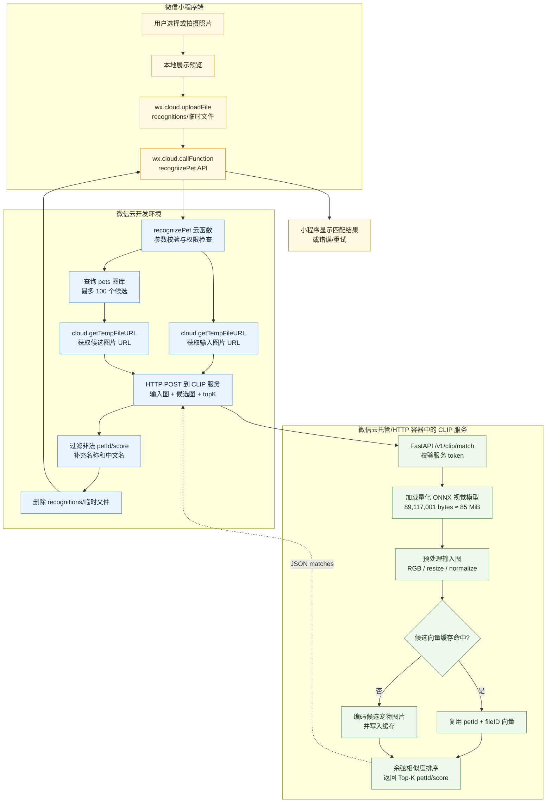

# 微信云 CLIP 识别流程

该图按执行顺序标注每一步所在位置、传递的数据以及本地缓存和图库向量缓存的作用。当前代码已实现小程序 API、`recognizePet` 云函数和量化 ONNX 推理服务；真实部署还需要配置微信云托管地址、环境变量和测试图库。

## 图中关键边界

- 小程序只负责选图、上传、调用云函数和展示结果，不持有 CLIP 模型或服务 token。
- 微信云函数负责权限、临时 URL、图库候选整理、结果过滤和临时文件清理。
- 微信云托管/HTTP 容器负责模型加载、图片编码和相似度计算；模型不会进入小程序包。
- 第一次请求可能触发模型冷启动；预热实例和图库向量缓存是 10 秒目标的关键。
