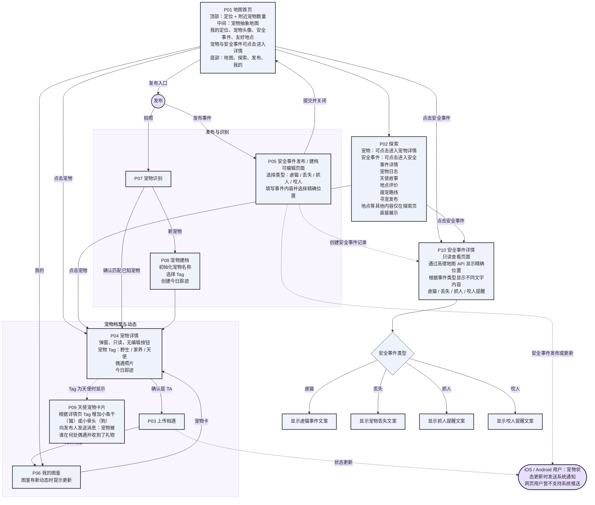

# 宠物地图产品流程

## 转换说明

- 保留了白板中的 P01-P09 页面编号、主要页面内容和用户流转。
- 为减少交叉线，将页面重新分为“发布与识别”和“宠物档案与动态”两个区域。
- 白板中 P09 与 P04 的箭头方向不够明确，这里按文字语义整理为“宠物 Tag 为天使时，从详情页展示天使宠物卡片”。
- 系统通知按白板备注连接到“上传相遇”和“安全事件更新”两个状态变化来源。
- P02 探索页当前只有宠物和安全事件支持点击进入各自详情；地点等其他内容直接在探索页展示，不增加详情页跳转。
- P05 安全事件与 P06 我的图鉴之间不存在流转关系。
- P05 是安全事件的可编辑发布/建档页；P10 是独立的只读安全事件详情页。
- P01 地图首页和 P02 探索页都可以点击安全事件进入 P10；P10 通过高德地图 API 展示精确位置。
- 安全事件详情根据虐猫、丢失、抓人、咬人四种类型显示不同的提示文字。
